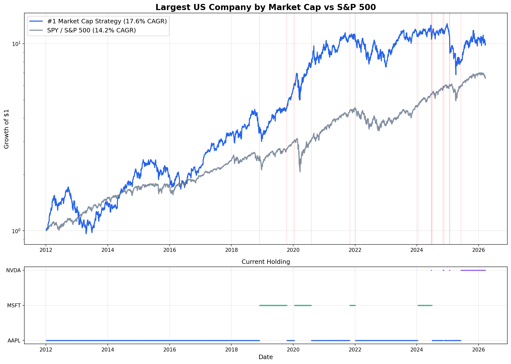

# SP1 — Full Port the #1

> What if you always held the largest US company by market cap?

Simple strategy: own whichever company is #1 by market cap. When leadership changes, switch at the next open. That's it.



## Results (2012 - Present)

| Metric | #1 Market Cap | S&P 500 |
|---|---|---|
| **CAGR** | 17.6% | 14.2% |
| **Outperformance** | +3.4%/yr | — |

The strategy has held **AAPL**, **MSFT**, **XOM**, and **NVDA** over the backtest period, with only ~15 switches in 13+ years.

## What's Inside

**`backtest.py`** — Python backtest using Yahoo Finance data. Tracks historical #1 transitions (Apple, Microsoft, Exxon, NVIDIA), simulates the switching strategy, and compares against SPY. Outputs stats + chart.

**`web/`** — Next.js dashboard that shows the current #1 company, the gap to #2, and a live top-5 leaderboard. Minimal dark UI.

## Run the Backtest

```bash
pip install yfinance pandas numpy matplotlib
python backtest.py
```

## Run the Dashboard

```bash
cd web
npm install
npm run dev
```

Open [localhost:3000](http://localhost:3000).

## Disclaimer

This is a research project, not financial advice. Past performance does not guarantee future results.
